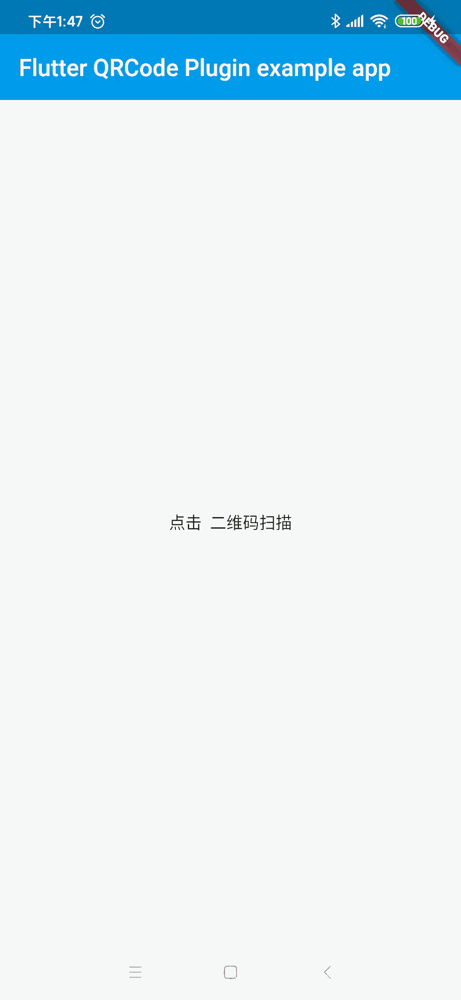

[TOC]

# flutter_plugin_qrcode

二维码扫描  同时支持 Android&IOS 

## Getting Started

扫描效果 

android 

IOS 
 

 
## 引入方式
 
 
 
      dependencies:
        flutter_plugin_qrcode: ^1.0.1

     
##导入头文件
        
            import 'package:flutter_plugin_qrcode/flutter_plugin_qrcode.dart';
     
## 使用 

      Future<void> getQrcodeState() async {
        String qrcode;
        try {
          qrcode = await FlutterPluginQrcode.getQRCode;
        } on PlatformException {
          qrcode = 'Failed to get platform version.';
        }
    
        if (!mounted) return;
        //获取到扫描的结果进行页面更新
        setState(() {
          _qrcode = qrcode;
        });
      }

 
##  注意事项 
    
####1,记得在AndroidManifest.xml 添加访问相机的权限 动态申请权限
    
        <uses-permission android:name="android.permission.CAMERA" />
        
#### 2,记得在IOS项目info.plist 文件添加相机的权限

        <!-- 相机 -->   
        <key>NSCameraUsageDescription</key>   
        <string>App需要您的同意,才能访问相机</string>   

     
 
 
##  关注公众号获取更多内容

